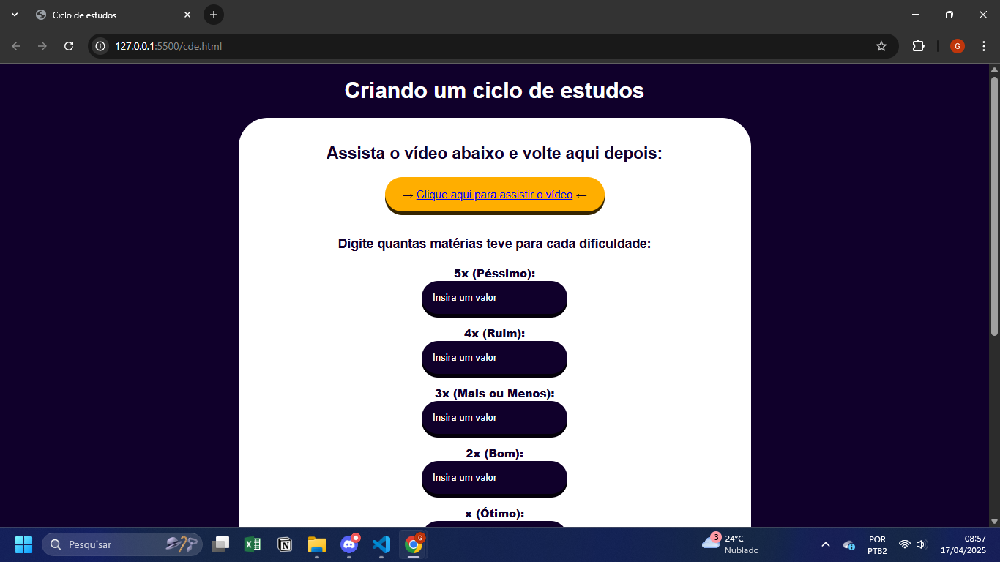
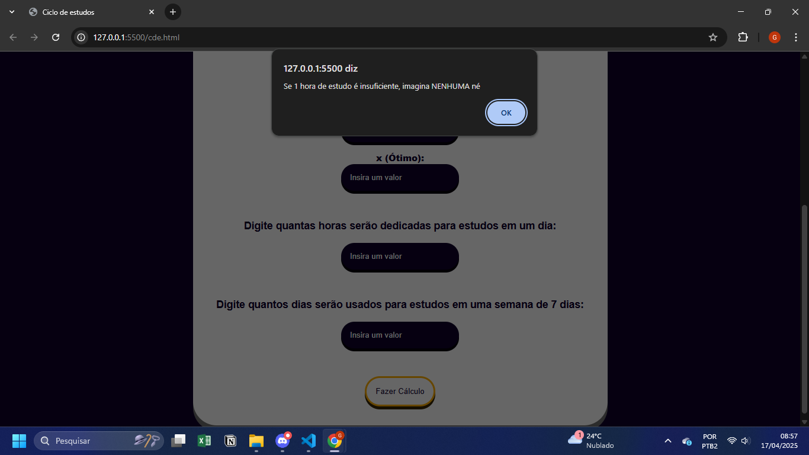
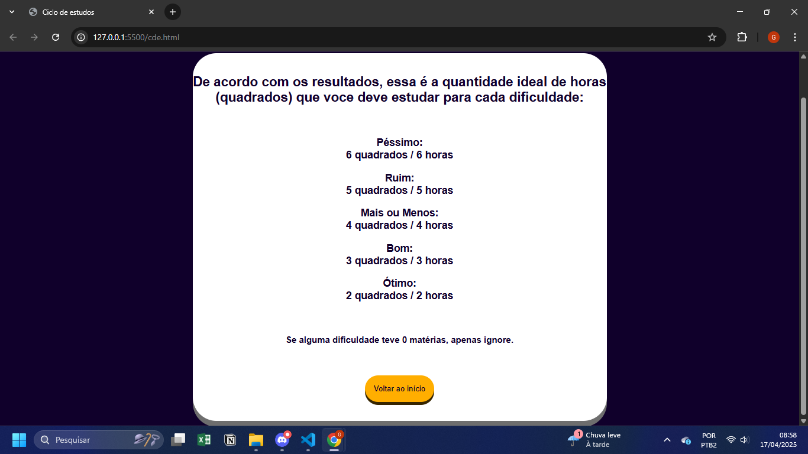

# Ciclo-de-estudos

⚙️ - Esse projeto foi feito com base em um vídeo do canal Matemática em Evidência( desde já deixo o crédito pelo conteúdo do Logan ). O site funciona para você usar ele para criar o ciclo de estudos automaticamente, apenas precisando inserir as configurações nele. Um projeto simples de HTML, CSS E JS.

❓- Agora, por que eu tô botando ele como "especial" se ele é simples? É porque esse é o meu último projeto compartilhado tanto aqui quanto no GitHub antes de eu adentrar de fato ao Backend.

💬 - Agora, eu estou um pouco mais focado em aprimorar o que eu já conheço da linguagem C. Mas principalmente, iniciei os meus estudos com Java e logo iniciarei os meus estudos com Power Bi. Ademais, começarei a fazer projetos em inglês, para praticar um pouco mais o meu nível de conhecimento com essa língua estrangeira.

📒 - O que eu aprendi com esse projeto:

• uso do Math.round(), comando usado para arredondar números

• Uso melhor de alguns elementos de estilo no CSS, como o max-width

➕ - Informações finais:

• Canal Matemática em Evidência, de onde eu tirei a referência para o projeto: https://www.youtube.com/channel/UCqLLvE_v2ktQVFO_TnSQoTg

• Meu Linkedin, onde já postei todo o funcionamento desse projeto: https://www.linkedin.com/in/gustavo-a-f/

Veja aqui abaixo prints do projeto em execução 👇

#HTML #CSS #JS #JavaScript #Frontend #Backend #GitHub #Java #PowerBi #C #Dev

